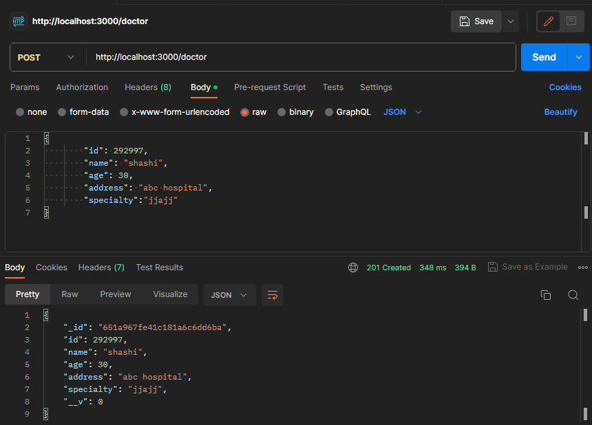
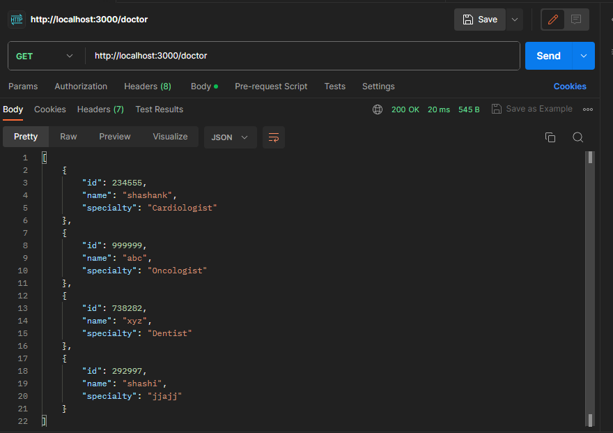
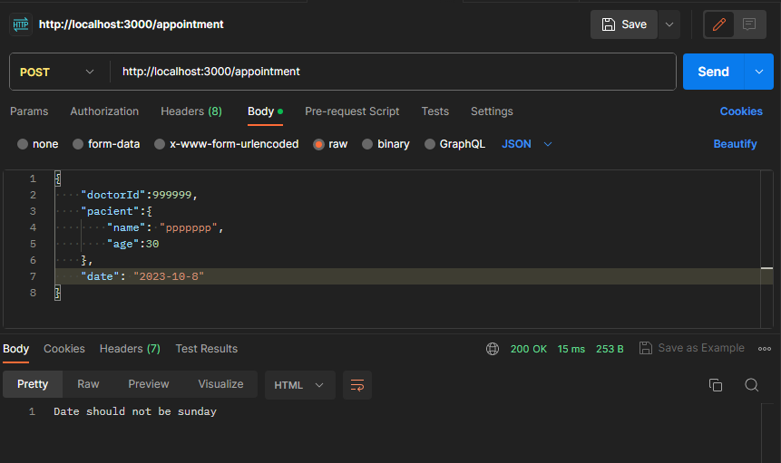
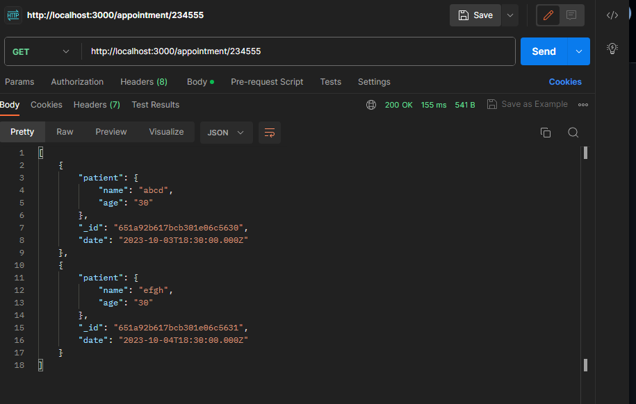

# Instructions for setting up and running the application

<h2>Clone the repo</h2>

step 1: use below cammand to clone the repo

<pre>
git clone https://github.com/shashanknaik0/Doctor-Appointment-System-PearlThoughts.git
</pre>

step 2: get into the directory
<pre>
cd Doctor-Appointment-System-PearlThoughts
</pre>

<h2>Install dependecies</h2>

use below cammand install dependecies from <code>package.json</code>
<pre>
npm install
</pre>

<h2>Seed some data to database</h2>
before seeding data make sure that you have installed MongoDB database and it is running in mongodb://127.0.0.1:27017
<pre>
npm run seed
</pre>

<h2>Run the project</h2>

use below cammand to run app in localhost.
<pre>
npm start
</pre>

<h2>API end points</h2>
<pre>
    (post) '/doctor' - create doctor 
    req body format = JSON {
        "id": number,
        "name": string,
        "age": number,
        "address": string,
        "specialty":string
    }
    (get) '/doctor' - list all doctor 
    (get) '/doctor/:id' - doctor details
    (put) '/doctor/:id' - update doctor
    req body format = JSON {
        "id": number,
        "name": string,
        "age": number,
        "address": string,
        "specialty":string
    }
    (delete) '/doctor/:id' - delete doctor

    (post) '/appointment' -  create appointment
    req body format = JSON {
        "doctorId":number,
        "patient":{
            "name": string,
            "age":number
        },
        "date": "YYYY-MM-DD"
    },
    (get) '/appointment' -  list all appointments 
    (get) '/appointment/:doctorId' -  list all appointments by doctor 
    (put) '/appointment/:id' -  update appoinmnet - 
    req body format = JSON req body format = JSON {
        "doctorId":number,
        "patient":{
            "name": string,
            "age":number
        },
        "date": "YYYY-MM-DD"
    },
    (delete) '/appointment/:id' - delete doctor
</pre>

<h2>Result</h2>

